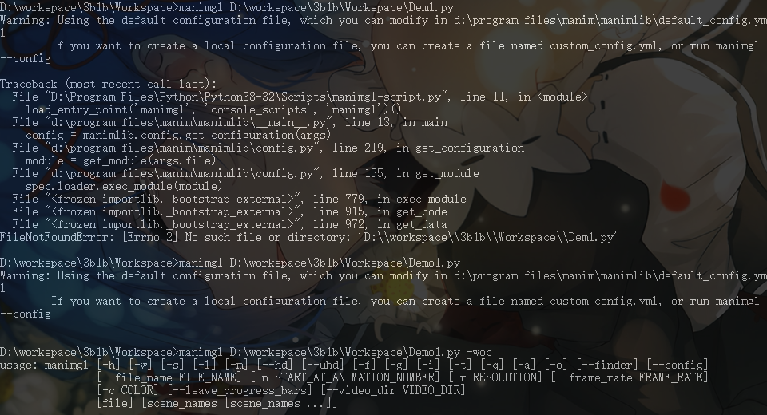
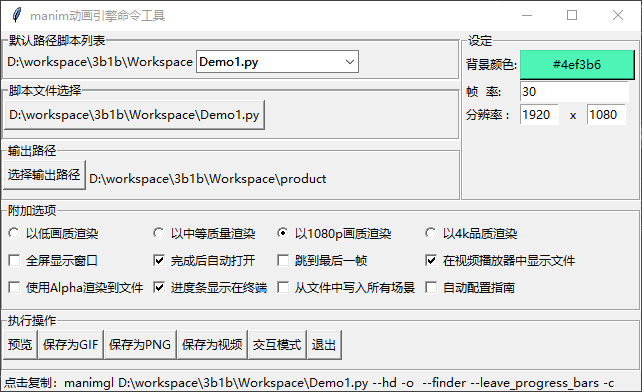

# ManimShortcutCmdTool
## 就字面意思这玩意叫Manim快捷Cmd工具
## 开发目的
* [3b1b那个视频引擎](https://github.com/3b1b/manim) 一堆操作都是cmd敲,我手速慢记性差，每次敲得我血压飙升，所以我一气之下弄了个这个玩意,点几下就行，多好！     
* ~~(懒才是第一生产力)~~
* 我很菜别喷
## 随便写个介绍
### 血压飙升↓

### 啊舒服了 ↓

#相关链接
[安装教学视频](https://www.bilibili.com/video/BV1ap4y1C7NF) ~~这个真的傻瓜安装教程~~   
[安装教学文档](https://www.bilibili.com/read/cv4139851) 搭配上面的教学是哦使用    
[官方文档](https://3b1b.github.io/manim/index.html) 这个东西没事查查就行了，主要还是得多玩玩